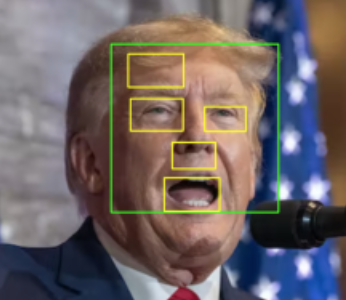
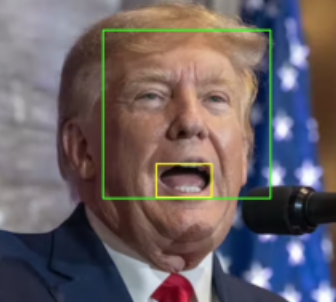

## 概要
マスク着用の有無を検出するためのプログラム

## 仕様
- opencvを使用

- 画像には一つの顔が写っていると仮定

- 顔が検出されない->マスクをつけていると顔が検出されにくくなるため、マスク着用と判断

- 口の検出に関して偽陽性(過剰に検出してしまう)が多いので、口候補の領域の内、もっとも下にある領域を口と仮定(口が下にあると仮定)

### 過剰な検出
 

### 正しい検出

 

## 顔及び口の検出に用いたデータ
- face 

https://github.com/opencv/opencv/tree/master/data/haarcascades

- mouth 

https://github.com/opencv/opencv_contrib/blob/1311b057475664b6af118fd1a405888bad4fd839/modules/face/data/cascades

